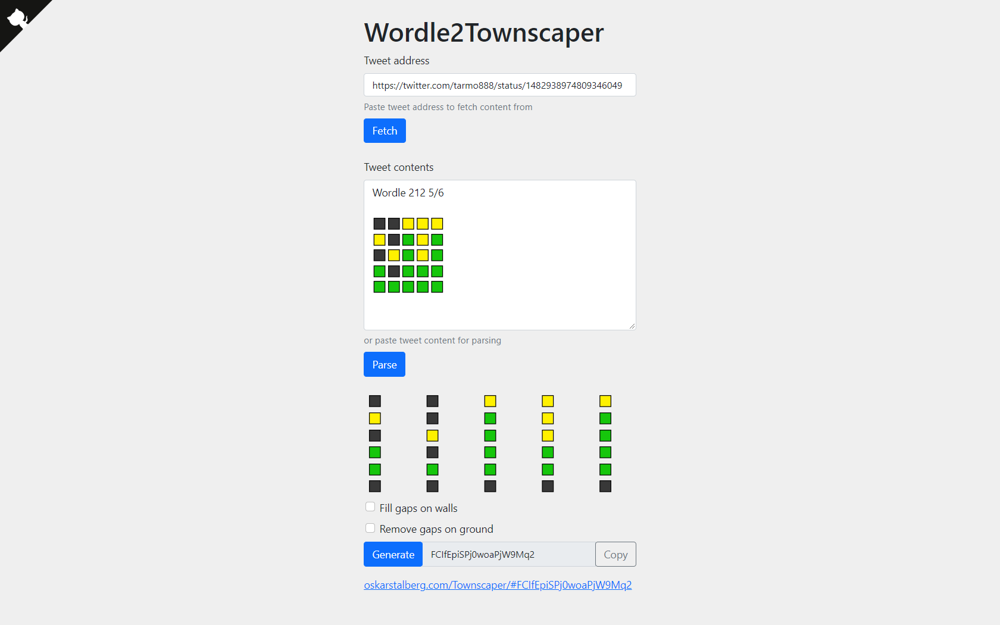
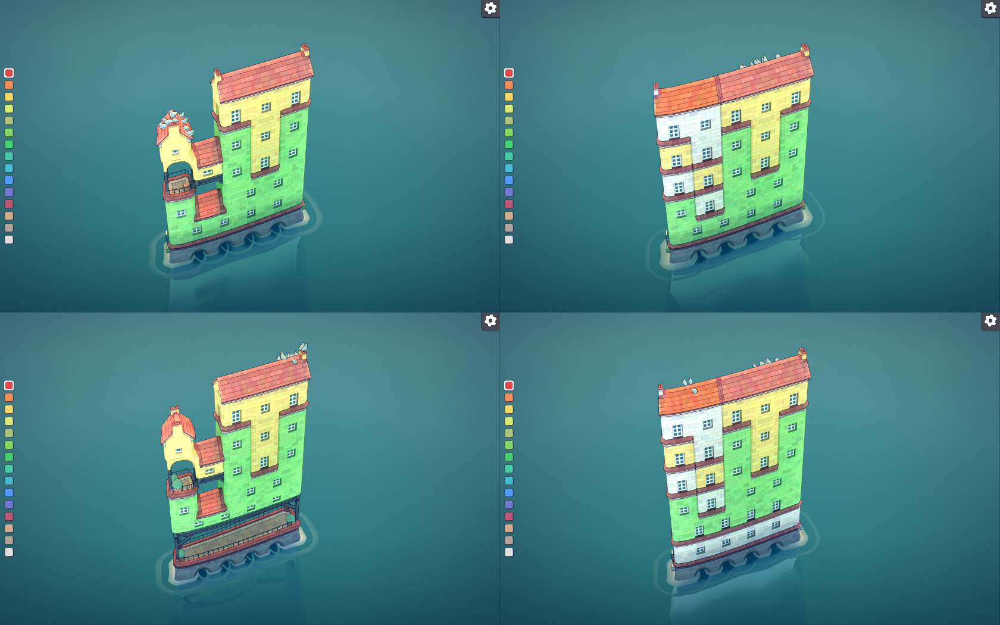

# Wordle2Townscaper

Wordle2Townscaper is meant to convert Wordle tweets into Townscaper houses using yellow and green building blocks. You can download the tweet contents, parse pasted tweet contents or manually edit of 6 rows and 5 columns. Optionally, you can also choose whether wrong guesses should be left blank on Townscapper or filled with white blocks. Ground floor is always needed because you can't change its color.

## Tech
~~This tool uses embedded tweet API to download (using proxy do avoid CORS) tweet contents, but that feature is optional.~~ It can parse tweet contents pasted from mobile or desktop browsers, and it uses Townclipper library to build hashes for Townscaper. This tool can be hosted on static HTML hosting, like Github.io.

## License
MIT

## Thanks
* https://www.powerlanguage.co.uk/wordle/
* https://www.townscapergame.com/
* https://github.com/alvaro-cuesta/townsclipper
* https://github.com/tholman/github-corners
* https://github.com/twbs/bootstrap
* https://allorigins.win/

## Donations
* [Github](https://github.com/sponsors/tarmo888)
* [PayPal](https://www.paypal.me/tarmo888)

